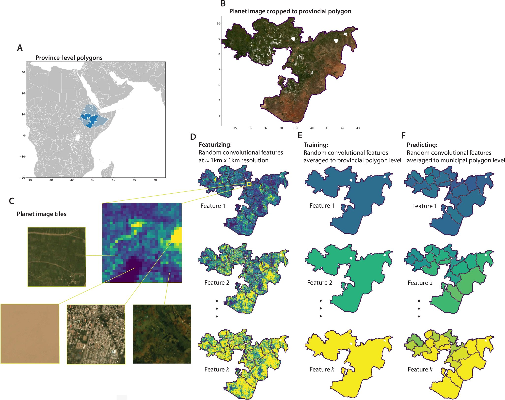

## Improving the resolution of administrative data with satellite imagery

Recently, my coauthors and I released <a href="https://www.nature.com/articles/s41467-026-68805-6" target="_blank" rel="noopener noreferrer">“Global high-resolution estimates of the UN Human Development Index using satellite imagery and machine learning”</a>. In this paper, we empirically validate the ability to use MOSAIKS and nighttime light (NL) features to increase the resolution of a coarse administrative dataset. 

 

<b>Fig. 1 from the paper: Aggregating satellite feature tiles up to the province and municipality level.</b>

 

## Training coarse, predicting fine

Most administrative data is available at only some highly aggregated level (e.g., provincial, district, or county level) and those units can be both irregularly shaped and wildly different in size. In this paper, we show that by using vectorized representations of a satellite image (an Earth Embedding) we can represent an arbitrarily shaped administrative polygon by averaging its feature values over space. This allows for large and irregularly shaped polygons to be represented by a single vector that contains much of the information in the satellite imagery for that polygon.

Next we show that it's possible to use that vector to estimate HDI and its components at the native (provincial/ADM1) resolution. Finally, we show that the model trained on provincial administrative imagery can be used to make estimates for finer (municipality/ADM2) administrative polygons. 

In this way, we demonstrate that satellite imagery can be used to train on arbitrarily shaped and coarse resolution, but then have predictive efficacy at much finer resolution.

I like to think about a crime film, where an investigator takes a fuzzy security camera image and then "enhances it" to magically produce an image at better resolution (where the criminal's face is often now visible). We show that by using satellite image embeddings as an auxiliary dataset, it's possible to do this exact thing with administrative datasets!

 

## Validating our efficacy

To test whether the province-trained model actually generalizes, we validate its predictions against ground-truth municipal HDI in Mexico, Brazil, and Indonesia — three countries where municipal-level HDI data actually exists. 

For each country, we find that our model substantially improves the granularity of the provincial (ADM1) HDI data, even though it was only trained on data at this level. Specifically, we are able to explain 45-61% of country-relative municipal variation, and 20-53% of province-relative variation, the latter number purely describing the amount of increased granularity we achieve from the satellite image-based method.
 

<b>Fig. 2C-D from the paper: how well the province-trained model predicts municipal HDI for three countries.</b>

 

## An HDI dataset at municipal (ADM2) resolution

The map below shows the coarse level of data that was used to train the model and the much finer resolution dataset that we are able to produce using the auxiliary satellite imagery. Specifically, the top row shows HDI at provincial (ADM1) resolution, as computed directly from raw survey data by <a href="https://www.nature.com/articles/sdata201938" target="_blank" rel="noopener noreferrer">Smits and Permanyer</a>. The bottom row shows the finer-resolution global gridded dataset — about 819,000 tiles — that we produce in this research.

 

<b>Province-level HDI (top) versus grid-level HDI at roughly 10km resolution (bottom).</b>

