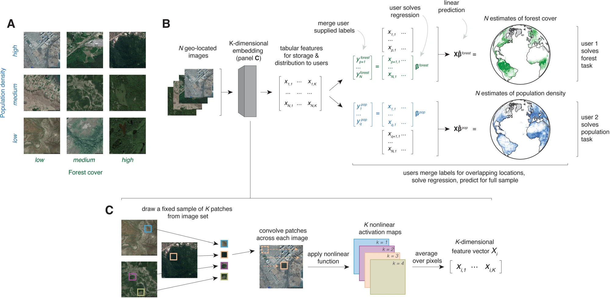

## The state of "earth embeddings"

In 2021, we published <a href="https://www.nature.com/articles/s41467-021-24638-z" target="_blank" rel="noopener noreferrer">a conceptually novel paper</a> explaining how satellite imagery can be represented in vector format, where information about image structure and content is contained by a set of numerical features. We show that a one-time, task-agnostic encoding of a satellite image can be used for a variety of downstream tasks.

 

<b>Fig. 1 from Rolf et al: A generalizable approach to combining satellite imagery with machine learning (SIML) without users handling images.</b>

 

In <a href="https://www.nber.org/papers/w34315" target="_blank" rel="noopener noreferrer">later research</a>, our author group demonstrated that this single feature encoding of a global image of the earth can be used to estimate, with considerable efficacy, over one hundred ground-truth variables across the globe: from income to crop yields, and even things like child mortality.

In recent years, this field has exploded in popularity and these vector representations of satellite images have become known as "earth embeddings." An excellent review of earth embeddings from Konstantin Klemmer, Esther Rolf, and others is available on <a href="https://eartharxiv.org/repository/view/11083/" target="_blank" rel="noopener noreferrer">EarthArXiv</a>. We recommend this paper as a starting point for anyone seeking to better understand this field and the current state of the literature.

In 2025, Google's DeepMind released <a href="https://deepmind.google/blog/alphaearth-foundations-helps-map-our-planet-in-unprecedented-detail/" target="_blank" rel="noopener noreferrer">AlphaEarth Foundations</a>, a set of earth embeddings, conceptually similar to what we called MOSAIKS, that is accessible via Earth Engine. 

We anticipate that the earth embeddings research field will continue to grow rapidly. Because publishing research papers can be a long process, we aim to use this blog as a vehicle to quickly communicate the things we learn in the research process to interested stakeholders. We hope that through The MOSAIKS Blog, we can keep the research and policy communities up-to-date on the state of the field as it continues to expand.
